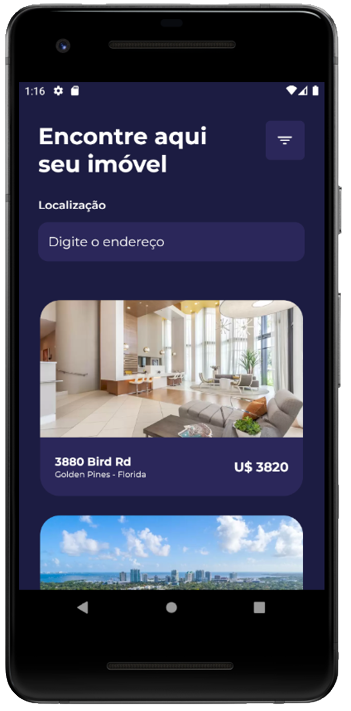

# FindHouses

## A mobile app that aids its users to locate real estates across the USA 

>FindHouses is an app that consumes an API via the RapidAPI platform and renders plenty of data related to the searched estates so as to suitably inform the user

Home Screen

Filter Screen

## Features

- Splash Screen
- Home screen with superficial information about several real estates
- Individualized screens containing detailed information about the selected real estate
- Filter screen that allows one to narrow the results according to one's preferences 

## Tech

A couple of technologies were employed in this project. Among them:

- [ReactNative] - a JavaScript library for building mobile apps
- [RapidAPI] - a massive API Hub used by developers to find and connect to tens of thousands of public APIs
- [Yarn] - a package manager
- [styled-components] - a package that allows the developer to write actual CSS code to stylize components
- [Storybook] - an open source tool for building UI components and pages in isolation
- [react-native-vector-icons] - a dependency for adding icons
- [Axios] - a Javascript library used to make HTTP requests
- [React Navigation] - a library for creating the navigation structure of an app.
- [Zustand] - a React state-manager that facilitates data persistence through screens
- [react-native-async-storage] - a local data storage system for React Native

    [ReactNative]: https://reactnative.dev/
    [RapidAPI]: https://rapidapi.com/
    [Yarn]: https://yarnpkg.com/
    [styled-components]: https://styled-components.com/
    [Storybook]: https://storybook.js.org/
    [react-native-vector-icons]: https://github.com/oblador/react-native-vector-icons
    [Axios]: https://axios-http.com/docs/intro
    [React Navigation]: https://reactnavigation.org/
    [Heroku]: https://www.heroku.com/
    [React Router DOM]: https://v5.reactrouter.com/web/guides/quick-start
    [Zustand]: https://github.com/pmndrs/zustand
    [react-native-async-storage]: https://react-native-async-storage.github.io/async-storage/